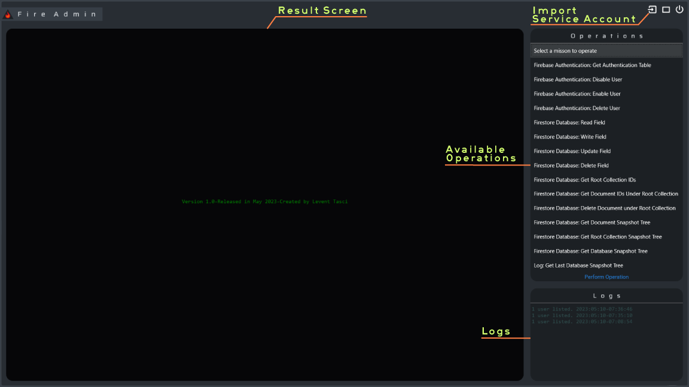

# FireAdmin

This project is a C# application that allows users to access Firebase and Firestore Database with FirebaseAdmin SDK. 
Project aims to provide an easy-access for those who uses Firebase for authenticate & authorize their users in their applications.

## User Interface

## Features

- This software is created for every-day usage of Firebase & Firestore Database at admin side with a proper user interface.
- There are 2 options in this software
	* option 1: Select your "Firebase Service Account" file.
	* option 2: Embed your "Firebase Service Account" to .../Firebase/FirestoreServiceAccount.json & build
- Saves last database snapshot to "Logs" folder and has ability to present it to user. 
	* Creates "Logs" folder in app directory if not exists. 
	* For every snapshot of the database, clears contents of the "Logs" folder and creates new .txt files for every root collection.
- Saves every action to "Logs.txt" in app directory and presents it to user in every action.
- Creates a treeview text from snapshots to view snapshot to user.
- Has a minimalist prossessing and welcome screen mechanism.
- Uses  https://github.com/BrunoVT1992/ConsoleTable/blob/4a86a2103c704fd09d35f48391d75433763698a3/ConsoleTable/Table.cs#L8 to create tables for Firebase Authentication, thanks BrunoVT1992 for this.
- There are 15 tasks which FireAdmin can perform in Version 1.0 

## About NuGet packages

- FireAdmin uses below NuGet packages:
	* FirebaseAdmin
	* FirebaseDatabase.net (why "N" is lowercase in .net is a mystery)
	* Google.Cloud.Firestore

## Important Notes

- Please remamber that FirebaseAdmin bypasses all security rules in 
  Firestore Database, never share your Service Account json file with your clients.
- This software operates on your database. Use it with extreme precaution,
  you may lost information or exceed Firebase read-write limits easily.
- If you are not familiar with Firebase usage, it's recommended that you test 
  it with a test project first. This can help you become more comfortable with 
  the platform and its features.

## Getting Started

To get started with this project, you'll need to:

1. Clone the repository
2. Open the project in Visual Studio
3. Install necessary NuGet packages
4. Build and run the application 

## Contributing

If you'd like to contribute to this project, you can:

- Fork the repository
- Make your changes
- Submit a pull request

## License

This project is licensed under the MIT License. See the LICENSE file for details.